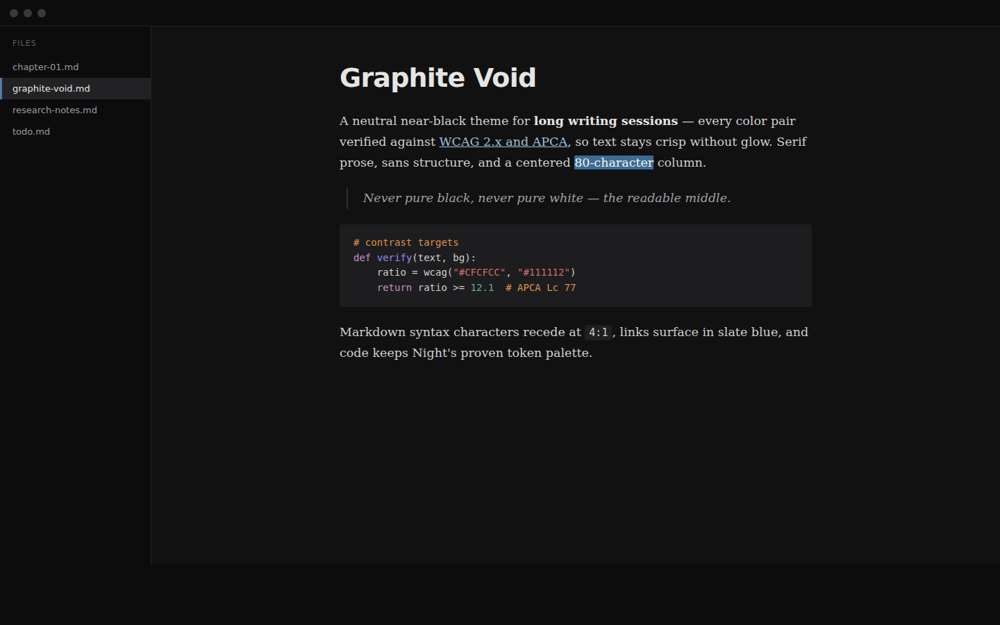

# Graphite Void — a Typora theme for long sessions

A neutral near-black theme (`#111112`) tuned for long writing and coding sessions on high-contrast displays. Every foreground/background pair is verified against **both WCAG 2.x and APCA** — bright enough to read fluently, never bright enough to glow.

## Design principles

- **Near-black, never pure black.** `#000` causes halation around glyphs (noticeable for the ~30–50 % of people with some astigmatism) and blooming on mini-LED panels. `#111112` (L\*≈5) is one step above YouTube's dark mode — the darkest zone that still allows visible elevation layers.
- **Dimmed gray text, never white.** Body text `#CFCFCC` lands at 12.1:1 / APCA Lc 77 — inside the fluent-reading band, below the halation zone.
- **Centered readable column.** 40–42 rem ≈ 680–714 px ≈ 75–85 characters per line (the classic 45–90 CPL readability band), instead of full-window lines.
- **Serif prose · sans structure · mono code.** Charter (ships with macOS; compact, low stroke contrast — the profile type designers recommend for light-on-dark) for body text, SF Pro at weight 600 for headings, JetBrains Mono for code. Every stack has graceful fallbacks; on Windows/Linux you get system serif/sans and colors/layout are unaffected. Prefer all-sans? Delete the single `TYPE SYSTEM` section at the bottom of the CSS.
- **Quiet hierarchy.** Markdown syntax characters at ~4:1 (visible, receding), sidebar darker than the editor, steel-blue accents kept muted.

## Installation

1. Download this repository (green **Code** button → **Download ZIP**) and unzip.
2. In Typora: **Settings/Preferences → Appearance → Open Theme Folder**.
3. Copy `graphite-void.css` into that folder.
4. Restart Typora → **Themes → Graphite Void**.

The theme builds on Typora's built-in **Night** theme skeleton and references its dark code-block / source-mode / mermaid styles via `@import "night/…"`. Those files ship with every Typora installation, so there is nothing extra to install.

Optional: install [JetBrains Mono](https://www.jetbrains.com/lp/mono/) (free) for the intended code font; otherwise code falls back to SF Mono/Menlo/Consolas.

## Credits

- Skeleton and code-token palette: Typora's built-in **Night** theme (© Typora, referenced, not redistributed).
- Contrast methodology: WCAG 2.x relative luminance + [APCA](https://git.apcacontrast.com/) perceptual contrast.

## License

MIT — see [LICENSE](LICENSE). The referenced built-in Night assets remain Typora's.
